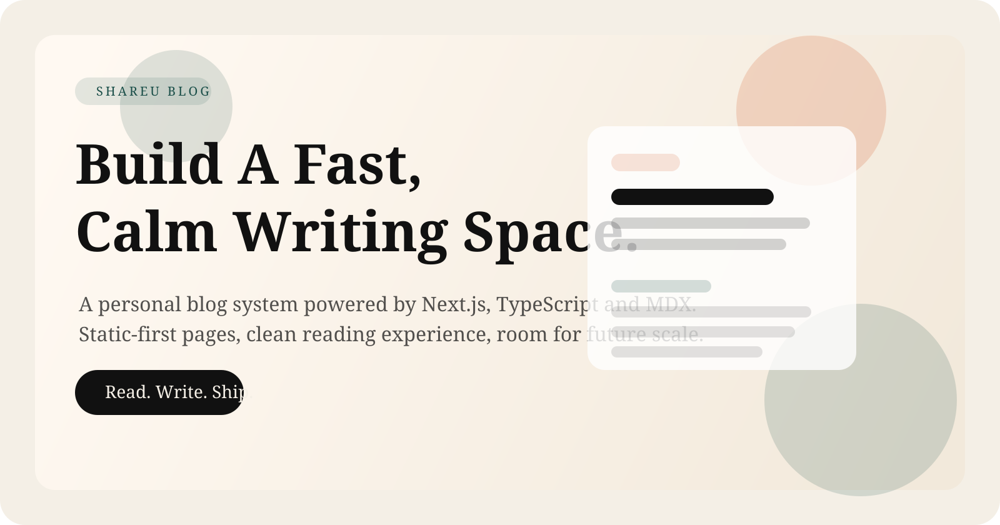

<p align="center">
  
</p>

<h1 align="center">Shareu Blog ✍️</h1>

<p align="center">
  一个基于 Next.js 15、TypeScript 和 MDX 的个人博客项目。
</p>

<p align="center">
  
  
  
  
</p>

## ✨ Features

- 🏠 首页、文章列表页、文章详情页
- 🏷️ 标签归档页
- 🧾 基于 MDX 的文章渲染
- 🔎 `robots.txt`、`sitemap.xml`、`rss.xml`
- ⚡ 静态优先的博客架构，适合持续扩展

## 🧱 Tech Stack

- Next.js 15
- React 18
- TypeScript
- Tailwind CSS
- MDX

## 🖼️ Preview

<p align="center">
  
</p>

## 🚀 Local Development

### 1. Install dependencies

```bash
npm install
```

### 2. Configure environment variables

```bash
cp .env.example .env.local
```

### 3. Start the dev server

```bash
npm run dev
```

默认访问地址：

```text
http://localhost:3000
```

## 🛠️ Scripts

```bash
npm run dev
npm run build
npm run start
npm run typecheck
```

## 📝 Content

文章目前存储在 [src/content/posts](/Users/shareu/Workspace/project-two/src/content/posts)。

每篇文章都是一个 `.mdx` 文件，包含：

- frontmatter：标题、描述、发布时间、标签
- 正文：MDX 内容

示例文章：

- [hello-world.mdx](/Users/shareu/Workspace/project-two/src/content/posts/hello-world.mdx)
- [rendering-with-mdx.mdx](/Users/shareu/Workspace/project-two/src/content/posts/rendering-with-mdx.mdx)

## 🔐 Environment Variables

见 [.env.example](/Users/shareu/Workspace/project-two/.env.example)。

## 🚢 Deployment

部署说明见 [docs/deployment.md](/Users/shareu/Workspace/project-two/docs/deployment.md)。

## 🤖 GitHub Actions

仓库已提供基础工作流：

- Push / PR 自动执行 `typecheck` 和 `build`
- 当 `main` 分支推送且配置好 Vercel secrets 时，可自动部署

工作流文件：

- [.github/workflows/ci.yml](/Users/shareu/Workspace/project-two/.github/workflows/ci.yml)

## 📌 Notes

- 当前文章数据源是本地 MDX 文件，不是数据库
- 这套结构适合个人博客先快速上线，后续再逐步加后台、评论、搜索和统计
